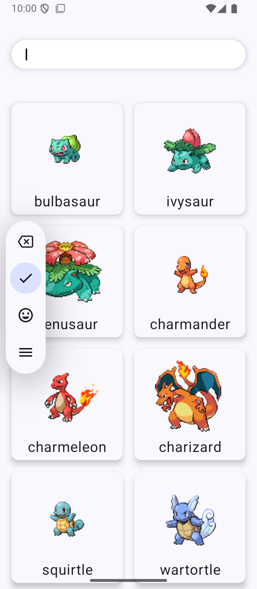
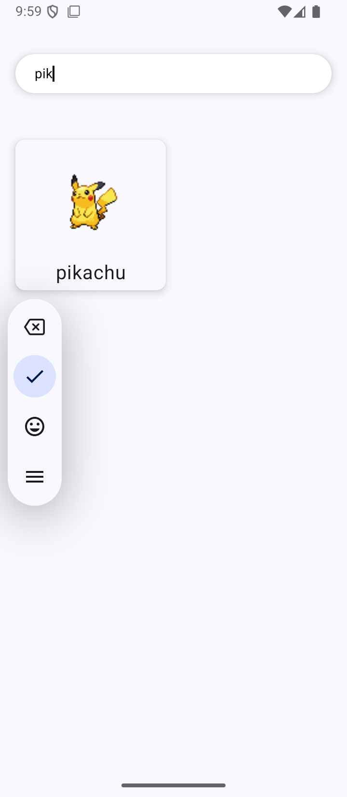

# Poke App

PokeApp built with Jetpack Compose, Hilt, Coroutines, Flow, Room and ViewModel based on MVVM architecture [PokeApi](https://pokeapi.co/).  

# Main Features
- PokeApp
  - Pokemon List - Search
  - Pokemon Detail

## Architecture
- MVVM Architecture (Model - ComposableView - ViewModel)
- Repository pattern

## Built With
- [Kotlin](https://kotlinlang.org/) - Work all project programming language for Android development.
- [Jetpack Compose](https://developer.android.com/jetpack/compose) - Build native UI.
- [Coroutines](https://kotlinlang.org/docs/reference/coroutines-overview.html) - For asynchronous
- [Flow](https://kotlin.github.io/kotlinx.coroutines/kotlinx-coroutines-core/kotlinx.coroutines.flow/-flow/) - A cold asynchronous data stream that sequentially emits values and completes normally or with an exception.
- [Android Architecture Components](https://developer.android.com/topic/libraries/architecture) - Collection of libraries that help you design robust, testable, and maintainable apps.
  - [LiveData](https://developer.android.com/topic/libraries/architecture/livedata) - Data objects that notify views when the underlying database changes.
  - [ViewModel](https://developer.android.com/topic/libraries/architecture/viewmodel) - Stores UI-related data that isn't destroyed on UI changes.

- [Dependency Injection](https://developer.android.com/training/dependency-injection)
  - [Hilt](https://dagger.dev/hilt) - Easier way to incorporate Dagger DI into Android apps.
- [Room](https://developer.android.com/training/data-storage/room) - The Room database provides an abstraction layer over SQLite to allow fluent database access while harnessing the full power of SQLite
- [Retrofit](https://square.github.io/retrofit/) - A type-safe HTTP client for Android and Java.

## Test
- ListViewModelTest (test )
- ExampleUnitTest (unit test)

## Built With

